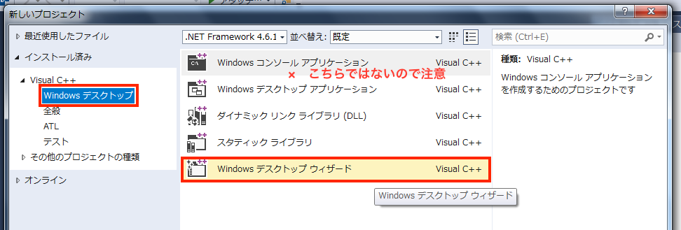
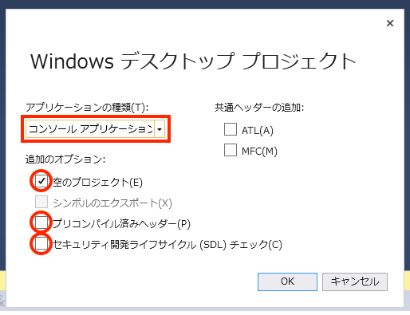

# プロジェクトの作成方法の違い

現時点（2017年10月）でインストールできる Visual Studio Community (Visual Studio 2017) では，
プロジェクトの作成方法が演習室とは異なっています．

メニューの「新規」から「新しいプロジェクト」を選択します．
ダイアログが表示されるので，左側から「Visual C++」の中の「Windows デスクトップ」を選択し，
中央で「Windows デスクトップウィザード」を選択します．
「ソリューションのディレクトリを作成」はチェックを外しておきましょう．

演習室と同じように「Windows コンソールアプリケーション」を選択するとハマりますので気をつけましょう．

ウィザードより，

- 「アプリケーションの種類」を「コンソールアプリケーション (.exe)」
- 「追加のオプション」で
  - 「空のプロジェクト」をチェックする
  - 「プリコンパイル済みヘッダー」のチェックを外す
  - 「セキュリティ開発ライフサイクル (SDL) をチェック」のチェックを外す

と設定します．

これで演習室と同じ環境で作業ができます．
