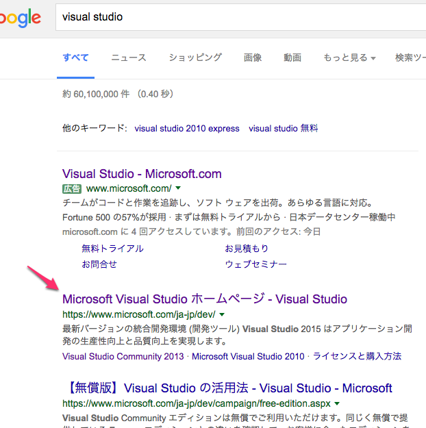
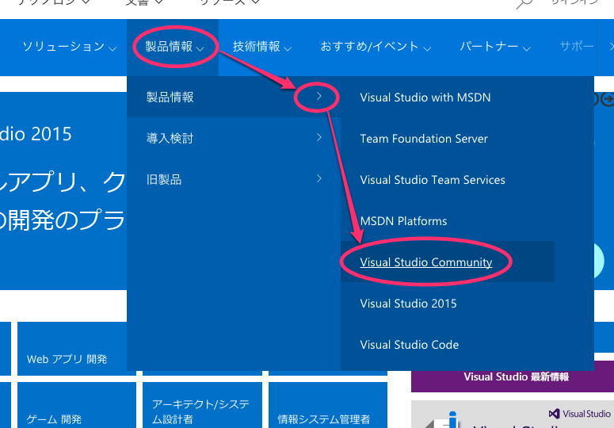
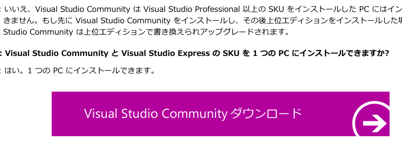
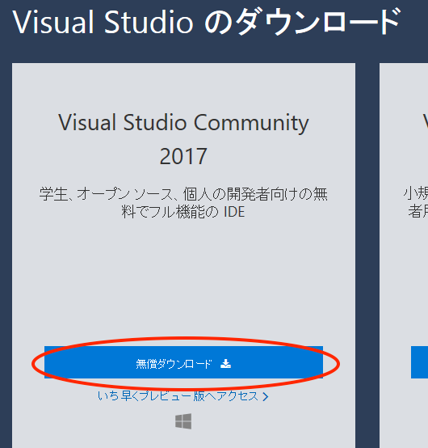

# 1. ダウンロードする

**注意：このページの内容は 2017年10月現在のものです．
変更されているかもしれませんので，適時読み替えてください．**

Visual Studio Community は無償でダウンロードできる開発ツールです．
まずは，ダウンロードのページを検索しましょう．

google などで「visual studio」と検索して下さい．

「Microsoft Visual Studio ホームページ」が見つかるはずです．
このページに移動して下さい．

そのページのメニューから「製品情報→製品情報→Visual Studio Community」を選択します．

ページの下の方にダウンロードするためのリンクがあるのでクリックします．

ページの左側にある「Community を無料ダウンロード」をクリックすると，ダンロードされます．

実際には，インストールの途中にも必要なファイルをダウンロードしますので，
ダウンロードが完了したわけではありません．
