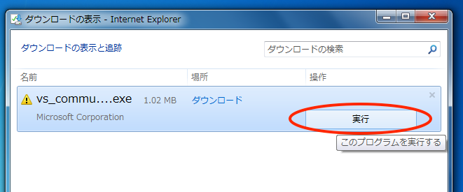
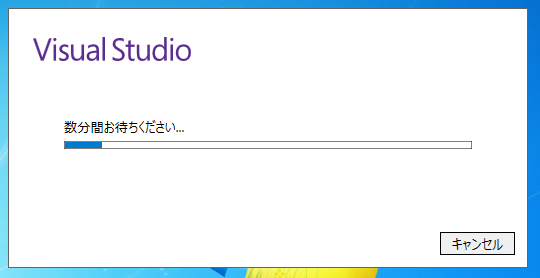

# 2. インストールする

ダウンロードされたインストーラを実行します．
多くの場合，「ダウンロード」フォルダに格納されているはずです．
Chrome ブラウザなら，ダウンロードしたファイルがブラウザの左下に表示されているはずですので，
これをクリックします．

インストーラが立ち上がり，インストールの種類を尋ねられます．
「カスタム」を選択して「次へ」を押しましょう．

「カスタム」を選択しないと C でプログラミングする環境がインストールされませんので注意してください．

「カスタム」を選択せずにインストールしてしまった場合も後からインストールすることができます．
もし事前に「既定」でインストールしてしまった人も安心してください．

「機能の選択」の中から「Visual C++」にチェックを入れて「次へ」を押します．
「Visual C++」がチェックされていないと C が使えません．

インストーラにも表示されていますが，この PC では「最大11GB」のディスク容量が必要となります．
容量が足りない場合はインストールする前にディスクの整理が必要かもしれませんね．

これでやっとインストールすることができます．
「インストール」を押しましょう．

必要なプログラムをダウンロードしながらインストールが進んでいきますので，気長に待ちましょう．
結構な時間がかかります．
私が試したときは3時間ぐらいかかりました．

ひたすら待ってインストールが完了した後，「起動」をクリックすることで VSC が立ち上がります．

