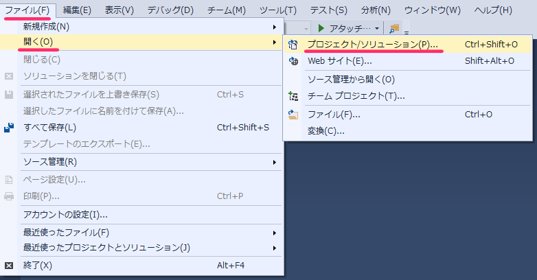
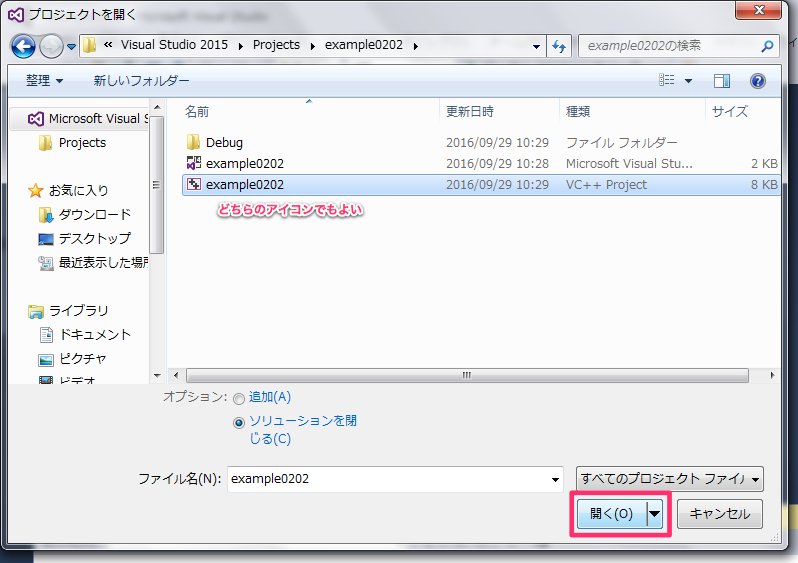

# 4. 既存のプロジェクトを選択

前回の授業で作成したプロジェクトなどを開くためには，
「ファイル」メニューより「開く」→「プロジェクト／ソリューション」を選択します．

開きたいプロジェクトのフォルダまで移動して下さい．
その中のファイルのうち，下記の2種類のファイルのどちらかを選択します．

上のファイルは「Microsoft Visual Studio Solution」という種類で，
下のファイルは「VC++ Project」という種類です．
アイコンで覚えておくとよいと思います．
